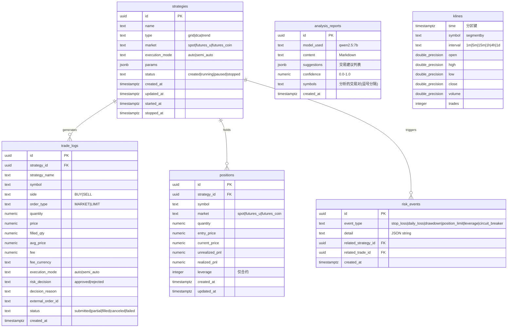

# FnAgent — 数据库设计文档

> 版本：v1.0 | 日期：2026-07-28 | DB: PostgreSQL 16 + TimescaleDB 2.x

---

## 目录

1. [设计规范](#1-设计规范)
2. [ER 实体关系图](#2-er-实体关系图)
3. [表结构详细设计](#3-表结构详细设计)
4. [索引策略](#4-索引策略)
5. [TimescaleDB 超表配置](#5-timescaledb-超表配置)

---

## 1. 设计规范

| 规范项 | 规则 | 说明 |
|--------|------|------|
| **主键** | `UUID` 字符串，Python 端生成 | 便于分布式扩展，避免自增 ID 冲突 |
| **时间戳** | `TIMESTAMPTZ` (带时区) | 交易系统需要精确时区 |
| **金额字段** | `NUMERIC(20,8)` | 避免浮点精度丢失（加密货币精度要求高） |
| **审计字段** | `created_at`, `updated_at` | 所有表标配 |
| **命名** | 小写下划线 (`snake_case`) | PostgreSQL 标准 |
| **索引命名** | `idx_{table}_{column}` | 统一规范 |
| **外键** | 显式声明 `REFERENCES` | 保证引用完整性 |
| **MVP 特殊** | ❌ 无 `tenant_id`（单用户）、❌ 无 `deleted`（暂不需要软删除） |

---

## 2. ER 实体关系图



---

## 3. 表结构详细设计

### 3.1 strategies — 策略配置表

| 列名 | 类型 | 约束 | 说明 |
|------|------|------|------|
| `id` | `UUID` | PK, NOT NULL | Python `uuid4()` 生成 |
| `name` | `TEXT` | NOT NULL | 策略名称，用户自定义 |
| `type` | `TEXT` | NOT NULL, CHECK | `grid` / `dca` / `trend` |
| `market` | `TEXT` | NOT NULL, CHECK | `spot` / `futures_u` / `futures_coin` |
| `execution_mode` | `TEXT` | NOT NULL, CHECK | `auto` / `semi_auto` |
| `params` | `JSONB` | NOT NULL, DEFAULT '{}' | 策略参数，结构因 type 而异 |
| `status` | `TEXT` | NOT NULL, DEFAULT 'created' | `created` → `running` → `paused` / `stopped` |
| `created_at` | `TIMESTAMPTZ` | NOT NULL, DEFAULT NOW() | |
| `updated_at` | `TIMESTAMPTZ` | NOT NULL, DEFAULT NOW() | 更新时自动刷新 |
| `started_at` | `TIMESTAMPTZ` | | 策略启动时间 |
| `stopped_at` | `TIMESTAMPTZ` | | 策略停止时间 |

**params JSONB 结构示例：**

```json
// grid
{
  "symbol": "BTCUSDT",
  "upper_price": 70000,
  "lower_price": 60000,
  "grid_count": 10,
  "invest_per_grid": 100
}

// dca
{
  "symbol": "ETHUSDT",
  "invest_amount": 50,
  "interval_hours": 4
}

// trend
{
  "symbol": "BTCUSDT",
  "fast_ma": 7,
  "slow_ma": 25,
  "position_ratio": 0.2
}
```

---

### 3.2 trade_logs — 交易记录表

| 列名 | 类型 | 约束 | 说明 |
|------|------|------|------|
| `id` | `UUID` | PK, NOT NULL | |
| `strategy_id` | `UUID` | FK → strategies.id, NOT NULL | |
| `strategy_name` | `TEXT` | NOT NULL | 冗余，便于查询 |
| `symbol` | `TEXT` | NOT NULL | 交易对，如 `BTCUSDT` |
| `side` | `TEXT` | NOT NULL, CHECK | `BUY` / `SELL` |
| `order_type` | `TEXT` | NOT NULL, CHECK | `MARKET` / `LIMIT` |
| `quantity` | `NUMERIC(20,8)` | NOT NULL | 下单数量 |
| `price` | `NUMERIC(20,8)` | | 限价单价格（市价单为 NULL） |
| `filled_qty` | `NUMERIC(20,8)` | | 实际成交数量 |
| `avg_price` | `NUMERIC(20,8)` | | 实际成交均价 |
| `fee` | `NUMERIC(20,8)` | DEFAULT 0 | 手续费 |
| `fee_currency` | `TEXT` | | 手续费币种 |
| `execution_mode` | `TEXT` | NOT NULL, CHECK | `auto` / `semi_auto` |
| `risk_decision` | `TEXT` | NOT NULL, CHECK | `approved` / `rejected` |
| `decision_reason` | `TEXT` | NOT NULL | 决策理由（审计核心字段） |
| `external_order_id` | `TEXT` | | 币安返回的订单 ID |
| `status` | `TEXT` | NOT NULL, CHECK | `submitted` → `partial` → `filled` / `canceled` / `failed` |
| `created_at` | `TIMESTAMPTZ` | NOT NULL, DEFAULT NOW() | |

---

### 3.3 positions — 持仓表

| 列名 | 类型 | 约束 | 说明 |
|------|------|------|------|
| `id` | `UUID` | PK, NOT NULL | |
| `strategy_id` | `UUID` | FK → strategies.id, NOT NULL | |
| `symbol` | `TEXT` | NOT NULL | |
| `market` | `TEXT` | NOT NULL, CHECK | `spot` / `futures_u` / `futures_coin` |
| `quantity` | `NUMERIC(20,8)` | NOT NULL | 持仓数量 |
| `entry_price` | `NUMERIC(20,8)` | NOT NULL | 开仓均价 |
| `current_price` | `NUMERIC(20,8)` | | 现价（定时刷新） |
| `unrealized_pnl` | `NUMERIC(20,8)` | DEFAULT 0 | 未实现盈亏 |
| `realized_pnl` | `NUMERIC(20,8)` | DEFAULT 0 | 已实现盈亏 |
| `leverage` | `INTEGER` | DEFAULT 1 | 杠杆倍数（现货 = 1） |
| `created_at` | `TIMESTAMPTZ` | NOT NULL, DEFAULT NOW() | |
| `updated_at` | `TIMESTAMPTZ` | NOT NULL, DEFAULT NOW() | |

---

### 3.4 risk_events — 风控事件表

| 列名 | 类型 | 约束 | 说明 |
|------|------|------|------|
| `id` | `UUID` | PK, NOT NULL | |
| `event_type` | `TEXT` | NOT NULL, CHECK | `stop_loss` / `daily_loss` / `drawdown` / `position_limit` / `leverage` / `circuit_breaker` |
| `detail` | `JSONB` | NOT NULL, DEFAULT '{}' | 事件详情（含触发阈值、当前值） |
| `related_strategy_id` | `UUID` | FK → strategies.id | 关联策略 |
| `related_trade_id` | `UUID` | FK → trade_logs.id | 关联交易 |
| `created_at` | `TIMESTAMPTZ` | NOT NULL, DEFAULT NOW() | |

**detail JSONB 示例：**

```json
// daily_loss
{
  "daily_loss": -150.50,
  "limit": -100.00,
  "percentage": 1.5,
  "action": "circuit_breaker_opened"
}

// stop_loss
{
  "symbol": "BTCUSDT",
  "entry_price": 65000,
  "trigger_price": 61750,
  "loss_percentage": 5.0,
  "action": "position_closed"
}
```

---

### 3.5 analysis_reports — AI 分析报告表

| 列名 | 类型 | 约束 | 说明 |
|------|------|------|------|
| `id` | `UUID` | PK, NOT NULL | |
| `model_used` | `TEXT` | NOT NULL | 如 `qwen2.5:7b` |
| `content` | `TEXT` | NOT NULL | Markdown 格式分析正文 |
| `suggestions` | `JSONB` | DEFAULT '[]' | 交易建议列表 |
| `confidence` | `NUMERIC(3,2)` | CHECK 0.0-1.0 | 综合置信度 |
| `symbols` | `TEXT` | NOT NULL | 分析的交易对，逗号分隔 |
| `created_at` | `TIMESTAMPTZ` | NOT NULL, DEFAULT NOW() | |

**suggestions JSONB 示例：**

```json
[
  {
    "symbol": "BTCUSDT",
    "action": "BUY",
    "confidence": 0.72,
    "reason": "金叉信号 + RSI 超卖反弹",
    "suggested_entry": 64500,
    "suggested_stop_loss": 63500,
    "suggested_take_profit": 67000
  }
]
```

---

### 3.6 klines — K线数据表 (TimescaleDB Hypertable)

| 列名 | 类型 | 约束 | 说明 |
|------|------|------|------|
| `time` | `TIMESTAMPTZ` | NOT NULL | K 线开盘时间（分区键） |
| `symbol` | `TEXT` | NOT NULL | segmentby 列 |
| `interval` | `TEXT` | NOT NULL | `1m` / `5m` / `15m` / `1h` / `4h` / `1d` |
| `open` | `DOUBLE PRECISION` | NOT NULL | |
| `high` | `DOUBLE PRECISION` | NOT NULL | |
| `low` | `DOUBLE PRECISION` | NOT NULL | |
| `close` | `DOUBLE PRECISION` | NOT NULL | |
| `volume` | `DOUBLE PRECISION` | NOT NULL | |
| `trades` | `INTEGER` | | 该 K 线内的成交笔数 |
| **PK** | | (`time`, `symbol`, `interval`) | 复合主键 |

---

## 4. 索引策略

### 4.1 主键索引（自动创建）

所有 PK 列自动创建唯一 B-Tree 索引。

### 4.2 业务查询索引

```sql
-- strategies: 按状态筛选
CREATE INDEX idx_strategies_status ON strategies(status) WHERE status = 'running';

-- trade_logs: 按策略 + 时间查询 (最高频)
CREATE INDEX idx_trade_logs_strategy_time ON trade_logs(strategy_id, created_at DESC);

-- trade_logs: 按交易对查询
CREATE INDEX idx_trade_logs_symbol ON trade_logs(symbol, created_at DESC);

-- trade_logs: 按时间范围查询 (导出 CSV)
CREATE INDEX idx_trade_logs_created_at ON trade_logs(created_at DESC);

-- positions: 按策略
CREATE INDEX idx_positions_strategy ON positions(strategy_id);

-- positions: 按交易对 (唯一持仓)
CREATE UNIQUE INDEX idx_positions_strategy_symbol ON positions(strategy_id, symbol);

-- risk_events: 按时间查询
CREATE INDEX idx_risk_events_time ON risk_events(created_at DESC);

-- risk_events: 按策略查询
CREATE INDEX idx_risk_events_strategy ON risk_events(related_strategy_id);

-- analysis_reports: 按时间查询
CREATE INDEX idx_analysis_reports_time ON analysis_reports(created_at DESC);
```

### 4.3 TimescaleDB 专属索引

```sql
-- klines 超表: segmentby 列自动优化，无需额外索引
-- 但需为时间范围查询创建索引
CREATE INDEX idx_klines_symbol_interval_time ON klines(symbol, interval, time DESC);
```

---

## 5. TimescaleDB 超表配置

```sql
-- 1. 将 klines 转为 Hypertable
SELECT create_hypertable('klines', 'time',
    chunk_time_interval => INTERVAL '1 day'
);

-- 2. 启用列式压缩 (segmentby 按 symbol+interval 分段)
ALTER TABLE klines SET (
    timescaledb.compress,
    timescaledb.compress_segmentby = 'symbol, interval',
    timescaledb.compress_orderby = 'time DESC'
);

-- 3. 7 天前的数据自动压缩
SELECT add_compression_policy('klines', INTERVAL '7 days');

-- 4. 连续聚合：预计算 1h K 线
CREATE MATERIALIZED VIEW klines_1h
WITH (timescaledb.continuous) AS
SELECT
    time_bucket('1 hour', time) AS bucket,
    symbol,
    FIRST(open, time) AS open,
    MAX(high) AS high,
    MIN(low) AS low,
    LAST(close, time) AS close,
    SUM(volume) AS volume
FROM klines
WHERE interval = '1m'
GROUP BY bucket, symbol;

-- 5. 自动刷新连续聚合 (每 5 分钟)
SELECT add_continuous_aggregate_policy('klines_1h',
    start_offset    => INTERVAL '2 hours',
    end_offset      => INTERVAL '1 minute',
    schedule_interval => INTERVAL '5 minutes'
);

-- 6. 数据保留策略 (仅保留 90 天 1m K线，1h+ 级别永久保留)
SELECT add_retention_policy('klines', INTERVAL '90 days');
```
